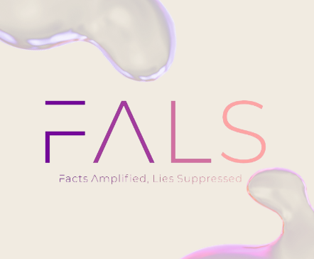

FALS
=====================================================================================================================================

*  🧙 Remember, you can do mighty things with the power of Your Mind.<be>
*  👩‍💻 Useful resources - Check out the Project Specifications Repo.

# Our Goal:
Our app aims to combat the spread of fake news by providing users with a reliable tool to detect and verify the authenticity of news articles. We aim to empower users to make informed decisions about the information they consume and share.

# What we will create:

We will create a user-friendly mobile application that allows users to enter or paste the URL of an article and receive an analysis of its authenticity. The app will leverage AI and machine learning techniques to evaluate the credibility of the news source and the article's content, providing users with an overall reliability score.

# What we will learn:

Throughout the development process, we will gain valuable knowledge and experience in:

* Integrating Flutter as a frontend framework for building cross-platform mobile applications.
* Building a Python-based backend server to handle user requests and process data.
* Functions and methods in Flutter, Python, and AI.
* Data types.
* Implementing AI and machine learning algorithms for natural language processing and fake news detection.
* Designing intuitive user interfaces and interactive user experiences in Flutter.
* Managing API requests and responses between the frontend and backend components.
* Error handling in Flutter and Python.
* Code refactoring.
* Basic debugging.
* Deploying the application to a cloud server or platform for users to access and utilize the fake news detection functionality.
* Integrating Blockchain as a smart contract.

# 💻 Technologies Used:

                    
